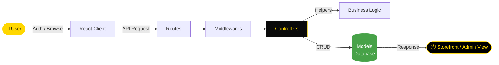

<div align="center">


[](https://git.io/typing-svg)

<br/>

<p align="center">
  <a href="https://github.com/NietoDeveloper">
    
  </a>
  <a href="https://committers.top/colombia#NietoDeveloper">
    
  </a>
  <a href="https://react.dev/">
    
  </a>
  <a href="https://nodejs.org/">
    
  </a>
  <a href="https://opensource.org/licenses/MIT">
    
  </a>
</p>

<p align="center">
  <a href="https://github.com/NietoDeveloper/FullStack_E-Commerce">
    
  </a>
</p>

</div>

---

## 📋 Overview

A **web application** built with **React**, **Node.js**, and JavaScript. This project consists of a client-side React application and a Node.js server. The client is located in the `client` folder, while the server and general instructions are in the root directory.

---

## 🗂️ Project Structure

```text
FullStack_E-Commerce/
├── client/                # React frontend
│   ├── public/
│   │   └── images/
│   └── src/
│       ├── components/
│       │   ├── Form/
│       │   ├── Layout/
│       │   └── Routes/
│       ├── context/
│       ├── hooks/
│       ├── pages/
│       │   ├── Admin/
│       │   ├── Auth/
│       │   └── user/
│       └── styles/
├── config/                 # Server configuration
├── controllers/             # Business logic handlers
├── helpers/                  # Helper functions
├── middlewares/                # Express middlewares
├── models/                       # Database models
└── routes/                        # RESTful API endpoints
```

---

## 🔄 Application Flow


---

## 🛠️ Technology Stack

<div align="center">

| Layer | Technologies |
|:------|:-------------|
| 🎨 **Frontend** | React, JavaScript |
| ⚙️ **Backend** | Node.js |
| 🔧 **Version Control** | Git / GitHub |

</div>

---

## 🚀 Getting Started

### Prerequisites

- Node.js (v16 or higher)
- npm (v8 or higher)

### Installation

**Step 1 — Clone the repository**

```bash
git clone https://github.com/NietoDeveloper/FullStack_E-Commerce
```

**Step 2 — Navigate to the project root**

```bash
cd FullStack_E-Commerce
```

**Step 3 — Install server dependencies**

```bash
npm install
```

**Step 4 — Install client dependencies**

```bash
cd client
npm install
```

### Running the Application

**Start the server** from the root directory:

```bash
npm start
```

**Start the client** from the client folder:

```bash
cd client
npm start
```

Access the application at `http://localhost:3000` (or the specified port).

---

## 🗂️ Project Structure Notes

- **`/client`:** React frontend code.
- **`/`:** Node.js server code and configuration.
- **`/public`:** Static assets (if applicable).
- **`/src`:** Client-side source code.

---

## 📜 Available Scripts

**In the root directory:**

| Command | Description |
|:--------|:-------------|
| `npm start` | Runs the Node.js server |
| `npm test` | Runs server-side tests (if configured) |

**In the client directory:**

| Command | Description |
|:--------|:-------------|
| `npm start` | Runs the React development server |
| `npm build` | Builds the React app for production |
| `npm test` | Runs client-side tests |

---

## 👨‍💻 Author

**Manuel Nieto** — Software Developer

---

## 📄 License

This project is licensed under the **MIT License**.

<div align="center">

<br/>


</div>


<div align="center">


[](https://git.io/typing-svg)

<br/>

<p align="center">
  <a href="https://github.com/NietoDeveloper">
    
  </a>
  <a href="https://committers.top/colombia#NietoDeveloper">
    
  </a>
  <a href="https://react.dev/">
    
  </a>
  <a href="https://nodejs.org/">
    
  </a>
  <a href="https://opensource.org/licenses/MIT">
    
  </a>
</p>

<p align="center">
  <a href="https://github.com/NietoDeveloper/FullStack_E-Commerce">
    
  </a>
</p>

</div>

---

## 📋 Overview

A **web application** built with **React**, **Node.js**, and JavaScript. This project consists of a client-side React application and a Node.js server. The client is located in the `client` folder, while the server and general instructions are in the root directory.

---

## 🗂️ Project Structure

```text
FullStack_E-Commerce/
├── client/                # React frontend
│   ├── public/
│   │   └── images/
│   └── src/
│       ├── components/
│       │   ├── Form/
│       │   ├── Layout/
│       │   └── Routes/
│       ├── context/
│       ├── hooks/
│       ├── pages/
│       │   ├── Admin/
│       │   ├── Auth/
│       │   └── user/
│       └── styles/
├── config/                 # Server configuration
├── controllers/             # Business logic handlers
├── helpers/                  # Helper functions
├── middlewares/                # Express middlewares
├── models/                       # Database models
└── routes/                        # RESTful API endpoints
```

---

## 🔄 Application Flow



---

## 🛠️ Technology Stack

<div align="center">

| Layer | Technologies |
|:------|:-------------|
| 🎨 **Frontend** | React, JavaScript |
| ⚙️ **Backend** | Node.js |
| 🔧 **Version Control** | Git / GitHub |

</div>

---

## 🚀 Getting Started

### Prerequisites

- Node.js (v16 or higher)
- npm (v8 or higher)

### Installation

**Step 1 — Clone the repository**

```bash
git clone https://github.com/NietoDeveloper/FullStack_E-Commerce
```

**Step 2 — Navigate to the project root**

```bash
cd FullStack_E-Commerce
```

**Step 3 — Install server dependencies**

```bash
npm install
```

**Step 4 — Install client dependencies**

```bash
cd client
npm install
```

### Running the Application

**Start the server** from the root directory:

```bash
npm start
```

**Start the client** from the client folder:

```bash
cd client
npm start
```

Access the application at `http://localhost:3000` (or the specified port).

